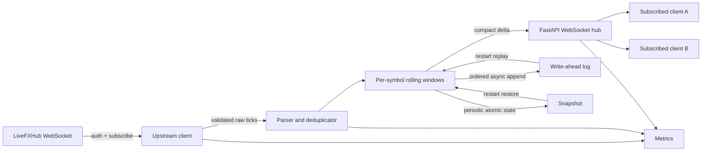

# Architecture

## Data flow

1. The Python `UpstreamClient` connects with `websockets`, sends credentials, waits for a positive authentication response, and only then sends the 61-symbol subscription.
2. The parser normalizes timestamps and validates only the trusted symbol and price fields. Feed-provided derived fields never enter the domain model.
3. `PricingEngine` rejects duplicate and too-old events, handles event-time ordering, and updates one isolated rolling window per symbol.
4. Accepted raw ticks enter an ordered `asyncio` WAL queue. The in-memory result immediately fans out through FastAPI to matching clients as a delta.
5. Atomic snapshots periodically capture active 24-hour state and then truncate the WAL. FastAPI's application lifespan restores state on startup and flushes it on shutdown.

## Complexity

For normal ordered input, insertion and extrema maintenance are amortized O(1) per tick. Eviction is O(1) amortized because each tick enters and leaves each monotonic deque once. An out-of-order event costs O(n) for its symbol to insert and rebuild extrema; this intentionally keeps the common hot path minimal. Memory is O(number of ticks received during the last 24 hours).

## Horizontal scaling

The submitted single-node service satisfies the assignment and has clean boundaries for scale-out. At higher volume, place a durable partitioned log between ingestion and processing, partition by symbol, and run stateless distribution gateways backed by a compacted latest-quote stream. Only one processor should own a symbol partition, avoiding distributed locks. Gateways can use consistent hashing or a broker pub/sub layer for fan-out.

## Failure boundaries

- Upstream disconnect: reconnect with capped exponential jitter; existing downstream clients remain connected and keep their last snapshot.
- Process restart: restore atomic snapshot, replay WAL, reconnect upstream.
- Duplicate tick: content fingerprint suppression.
- Out-of-order tick: insert by event time if still inside the active window; never regress current buy/sell.
- Traffic spike or slow consumer: non-blocking fan-out plus per-client buffered-byte cutoff.
- Corrupt partial WAL tail: skip only an invalid final record; valid preceding records remain usable.
